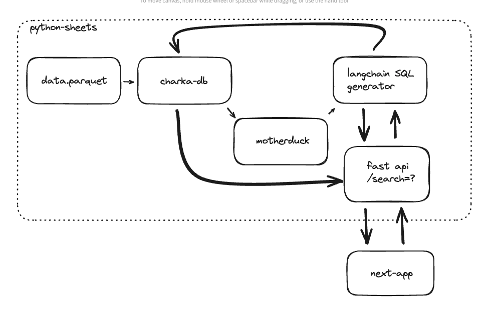

# problem

build a python fastapi to search through a database of linkedin profiles

## project overview

a python fastapi to search through a database of linkedin profiles

using chakra sdk to store the data in a database, and fastapi to build the search api.

using next.js to build the frontend and interact with the fast api.

## run the project

### 1. install the dependencies

```bash
cd python_sheets
pip install -r requirements.txt
```
### 2. create a .env file

```bash
cp .env.example .env
```
add the environment variables

```bash
CHAKRA_DB_SESSION_KEY=your_chakra_db_session_key
NEW_OPENAI_API_KEY=your_new_openai_api_key
MOTHERDUCK_TOKEN=your_motherduck_token
```
### 3. load data to chakra database

create a data folder inside python_sheets and download the linkedin_profiles.parquet file from the google drive link in the slack channel and put it in the data folder

run the following command to load the data to the chakra database

```bash
python python_sheets/chakra_api/chakra_client.py load
```

verify the data is loaded by running the following command

```bash
python python_sheets/chakra_api/chakra_client.py query 10
```

### 4. load data to motherduck

```bash
python python_sheets/loader/loader.py
```

### 5. run the backend

```bash
cd python_sheets
uvicorn main:app --reload
```

### 6. run the frontend

```bash
cd next_streets
npm install
npm run dev
```

## current file structure

```bash
├── /work-trial-sang/
├── python_sheets/
│   ├── main.py
│   ├── api/
│   │   └── endpoints/
│   │       └── profiles.py
│   ├── chakra_api/
│   │   └── chakra_client.py
│   ├── data/
│   │   └── linkedin_profiles.parquet
│   └── models/
│   │    └── profile.py
│   │    └── search.py
│   └── loader/
│        └── loader.py
├── next_streets/
│   ├── app/
│   │   └── page.tsx
│   ├── public/
│   │   └── chakra.jpg
│   ├── .env
│   └── package.json
├── requirements.txt
└── .env
```

## architecture



## feedback on search queries

- "what profiles" results in better search results. for ex: what profiles have a phd and work in AI
- "who" results in bad results. for ex: who is working with solidity results in 0 results (probably because semantic search is not impelmented)
- word accuracy matters. for ex: what profiles work in web3 results in 0 results, what profiles mention cryptocurrency results in 12 results
- sometimes you don't get any results because of a bad query generated by the LLM. however, retrying results in better results. multishotting can be implemented to get better results.
- render api instance takes 50 seconds to start up.

## future improvements

- [ ] load and searchmultiple databases
- [ ] embedded vector search
- [ ] multishotting
- [ ] remove motherduck
- [ ] host on a paid render instance
- [ ] handle large datasets
- [ ] graphql to improve embeddings
- [ ] frontend table with links to profiles
- [ ] add recruitment profile and get result profiles


## monetization plan

### big exa clients

- techcruch (evabot)
- databricks
- jotbot

### niches

- crypto/web3
- sustainability
- healthcare and biotech
- education and edtech

### small clients

- crypto
  - colloseum
  - superteam earn
  - gibwork
  - hype
  - spectrum search
  - proof of talent

- sustainability
  - airswift
  - spencer ogden

- healthcare and biotech
  - kforce
  - aerotek

- education and edtech
  - skillsoft
  - brainPOP

### pricing

- $10 per query
- $50K one time payment
